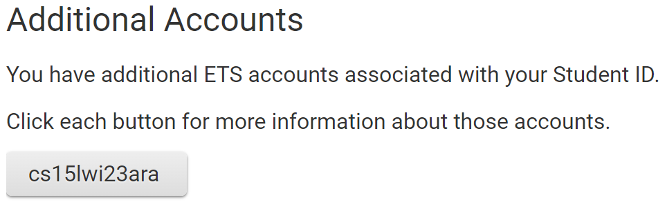
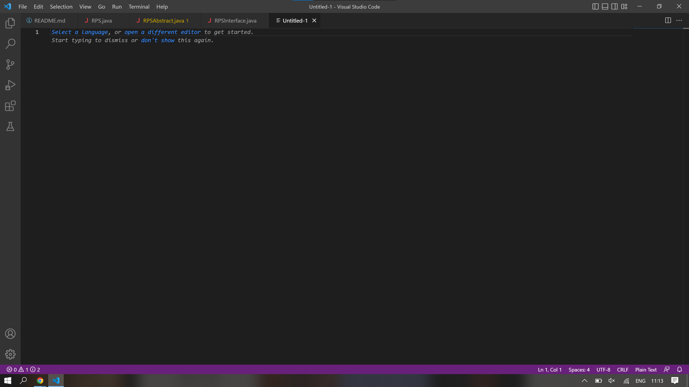
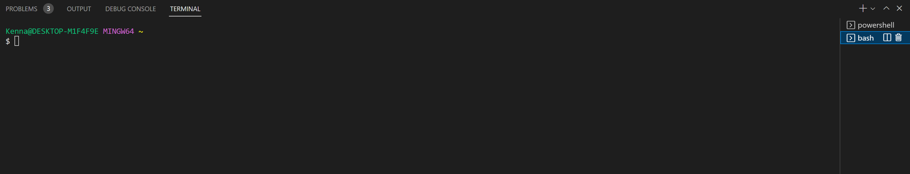
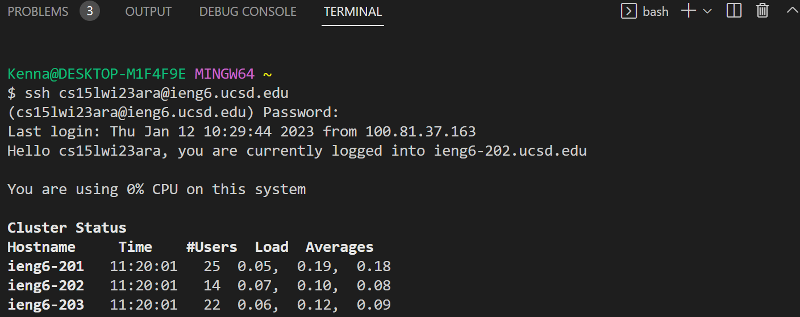
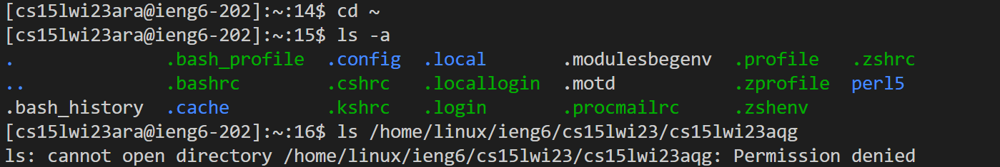

# Remote Access Tutorial  

**Step 1: Account Lookup**  
Click [Here](https://sdacs.ucsd.edu/~icc/index.php) and log in with your Tritonlink username and PID  
Click the button for your course-specific account (in this case it would be the CSE15L one)  
  

If you need to reset your password, follow this [Tutorial](https://docs.google.com/document/d/1hs7CyQeh-MdUfM9uv99i8tqfneos6Y8bDU0uhn1wqho/edit)  

**Step 2: Install Visual Studio Code**  
It may take a while for your password to properly reset. Take this time to install VSCode. I already had it installed, but you may follow the instructions from the [official VSCode website](https://code.visualstudio.com/) if needed.   
Once it is installed, you should be able to open VSCode and create a new file  


**Step 3: Setup Git (if you're on Windows)**    
Download Git from [this link](https://gitforwindows.org/) and install the program (keeping the default settings should be fine).  
Follow [this tutorial](https://stackoverflow.com/questions/42606837/how-do-i-use-bash-on-windows-from-the-visual-studio-code-integrated-terminal/50527994#50527994) to use Bash in the VSCode terminal.  
  
It should look something like this.

**Step 4: Logging into your account**  
In the Bash terminal in VSCode (ctrl + \`), enter the following command, replacing ACCOUNT_NAME with what you got in step 1:  
```
$ ssh ACCOUNT_NAME@ieng.ucsd.edu
```
If prompted, type yes and hit enter.  
You should get something like this:  


**Step 5: Trying some commands**
Try out your typical commands like ls and cd, but also try accessing your friend's directory! Permission should be denied for the last command.  
  

## And that's it! You're good to go:)


