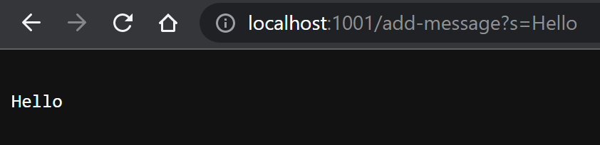
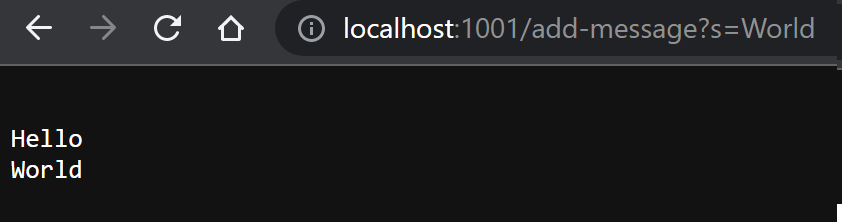
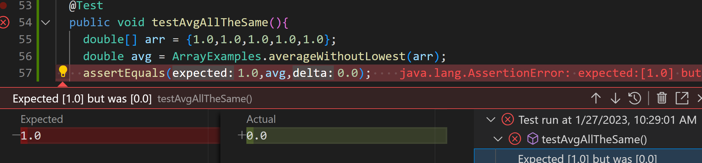
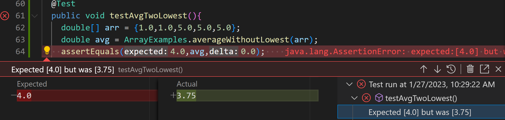

# Lab Report 2  
  
## Part 1: StringServer
I created 2 java files for ```StringServer```, ```SearchEngine.java``` and ```Server.java```.  

The code for the server is basically the one from lab 2:  
```java
// A simple web server using Java's built-in HttpServer

// Examples from https://dzone.com/articles/simple-http-server-in-java were useful references

import java.io.IOException;
import java.io.OutputStream;
import java.net.InetSocketAddress;
import java.net.URI;

import com.sun.net.httpserver.HttpExchange;
import com.sun.net.httpserver.HttpHandler;
import com.sun.net.httpserver.HttpServer;

interface URLHandler {
    String handleRequest(URI url);
}

class ServerHttpHandler implements HttpHandler {
    URLHandler handler;
    ServerHttpHandler(URLHandler handler) {
      this.handler = handler;
    }
    public void handle(final HttpExchange exchange) throws IOException {
        // form return body after being handled by program
        try {
            String ret = handler.handleRequest(exchange.getRequestURI());
            // form the return string and write it on the browser
            exchange.sendResponseHeaders(200, ret.getBytes().length);
            OutputStream os = exchange.getResponseBody();
            os.write(ret.getBytes());
            os.close();
        } catch(Exception e) {
            String response = e.toString();
            exchange.sendResponseHeaders(500, response.getBytes().length);
            OutputStream os = exchange.getResponseBody();
            os.write(response.getBytes());
            os.close();
        }
    }
}

public class Server {
    public static void start(int port, URLHandler handler) throws IOException {
        HttpServer server = HttpServer.create(new InetSocketAddress(port), 0);

        //create request entrypoint
        server.createContext("/", new ServerHttpHandler(handler));

        //start the server
        server.start();
        System.out.println("Server Started! Visit http://localhost:" + port + " to visit.");
    }
}

```  

And here is the code for ```SearchEngine.java```:  
```java
import java.io.IOException;
import java.net.URI;

class Handler implements URLHandler {
    // The one bit of state on the server: a number that will be manipulated by
    // various requests.
    
    String str = "";
    public String handleRequest(URI url) {
        if (url.getPath().equals("/")) {
            return str;
        } 
        else {
            System.out.println("Path: " + url.getPath());
            if (url.getPath().contains("/add-message")) {
                String[] parameters = url.getQuery().split("=");
                if (parameters[0].equals("s")) {
                    str += "\n" + parameters[1];
                    return str;
                }
            }
            return "404 Not Found!";
        }
    }
}

class StringServer {
    public static void main(String[] args) throws IOException {
        if(args.length == 0){
            System.out.println("Missing port number! Try any number between 1024 to 49151");
            return;
        }

        int port = Integer.parseInt(args[0]);

        Server.start(port, new Handler());
    }
}

class SearchEngine {
    public static void main(String[] args) throws IOException {
        if(args.length == 0){
            System.out.println("Missing port number! Try any number between 1024 to 49151");
            return;
        }

        int port = Integer.parseInt(args[0]);

        Server.start(port, new Handler());
    }
}
``` 
  
  
---
### Running the Server  
---
After starting the server, I used ```add-message?s=Hello``` to achieve the following:  
  
  

### Methods Called:  

The method ```handleRequest()``` is called. Since the path contains ```add-message```, it splits the query into a String array with the delimeter ```=```.  
```parameter[0]``` is thus ```s```, and ```parameter[1]```, which is ```Hello``` in this case, is added to the String variable ```str```. ```str``` is then displayed on the page.
  
  
### Adding another word  
To add another word, I used ```add-message?s=World``` to achieve the following:  
  
  
  
  
### Methods Called:  
The method ```handleRequest()``` is called again. Since ```parameter[1]``` is ```World``` this time, ```\nWorld``` is concatenated to the running string ```str```, and then displayed on the page.
  
  ---
  
## Part 2: Bugs
The bug I chose is one from ```ArrayExamples.java```, and it is the one pertaining to the ```averageWithoutLowest()``` method.  
A failure-inducing input would be an array where all the values are the same (eg. ```{1.0,1.0,1.0,1.0,1.0}```), as shown below: 
```java
  @Test
  public void testAvgAllTheSame(){
    double[] arr = {1.0,1.0,1.0,1.0,1.0};
    double avg = ArrayExamples.averageWithoutLowest(arr);
    assertEquals(1.0,avg,0.0);
  }
 ```  
 An input that doesn't induce a failure is an array with only one value (eg. ```{1.0}```): 
 ```java
   @Test
  public void testAvgOneValue(){
    double[] arr = {1.0};
    double avg = ArrayExamples.averageWithoutLowest(arr);
    assertEquals(0.0,avg,0.0);
  }  
```
   
A symptom of the bug can be seen when running the test using arrays that contain the lowest value more than once:  
  
  
  
The problematic code is this portion:  
```java 
  static double averageWithoutLowest(double[] arr) {
    if(arr.length < 2) { return 0.0; }
    double lowest = arr[0];
    for(double num: arr) {
      if(num < lowest) { lowest = num; }
    }
    double sum = 0;
    for(double num: arr) {
      if(num != lowest) { sum += num; }
    }
    return sum / (arr.length - 1);
  }
```
The code does not include a value in the array into the sum as long as it is equivalent to the lowest value. Thus, if the lowest value appears more than once, the calculated average would be wrong.  
The corrected code would look something like this:  
```java 
  static double averageWithoutLowest(double[] arr) {
    if(arr.length < 2) { return 0.0; }
    double lowest = arr[0];
    for(double num: arr) {
      if(num < lowest) { lowest = num; }
    }
    double sum = 0;
    for(double num: arr) {
      sum += num;
    }
    return (sum -= lowest) / (arr.length - 1);
  }
```  
With the corrected code, the lowest value is deducted from the sum only once at the end of for loop, leading to the correct answer.  
  
## Part 3: Things I Learnt  
I learned about how to use AssertEquals with floats - for the version of JUnit that I am using, an additional delta argument is required as a parameter. I also learned that tests often don't need many values to display symptoms of bugs. 
