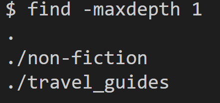
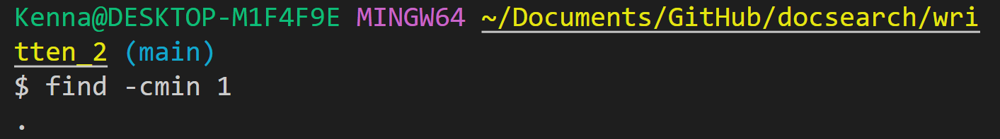
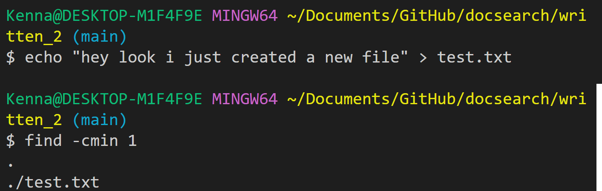

# Cool -find commands  

*All commands were found on https://man7.org/linux/man-pages/man1/find.1.html*
  
## find -maxdepth  num
Using this option means the find command will descend at most **num** (a non-negative integer) levels of directories below the starting-points.  
  
-maxdepth 1 only searches for files/directories 1 level "deep" into the written_2 directory.
  
By specifying a number to be the maximum depth to be searched, you can cut down on the runtime significantly. 
This is very useful if you don't want to find every single file within a directory.  

## find -cmin n  
Find files that had its status last changed less than, more than or exactly n minutes ago.  
  
Since I had not edited any of the files in the directory, ```find -cmin 1``` does not return any files at first.  
  
However, once I created a new file in the directory, the same command will now return this new file because it was modified within the latest minute. This is useful for when a directory is full of old files, but I am only interested in the newer, more recently modified files.  

##


