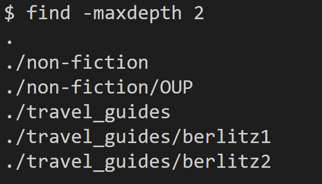

# Cool -find commands  

*All commands were found on https://man7.org/linux/man-pages/man1/find.1.html*
  
## ```find -maxdepth  num```
Using this option means the find command will descend at most **num** (a non-negative integer) levels of directories below the starting-points.  
  
-maxdepth 1 only searches for files/directories 1 level "deep" into the written_2 directory.  
  
By specifying a number to be the maximum depth to be searched, you can cut down on the runtime significantly. 
This is very useful if you don't want to find every single file within a directory.  

## ```find -cmin n```  
Find files that had its status last changed less than, more than or exactly n minutes ago.  
  
Since I had not changed any of the files in the directory, ```find -cmin 1``` does not return any files at first.  
  
However, once I created a new file in the directory, the same command will now return this new file because it was changed within the latest minute. This is useful for when a directory is full of old files, but I am only interested in the newer, more recently changed files.  

## ```find -type c```  
Find files of type c, where c can be any of the following values:  
b      block (buffered) special  
c      character (unbuffered) special  
d      directory  
p      named pipe (FIFO)  
f      regular file  
l      symbolic link  
s      socket  
D      door (Solaris)  
  
I can choose such that I only list out the files, and not list out the directories.  
  
Or I can choose to just list out the folder and directories. This makes it much simpler for me to do a wc on the number of files or directories specifically.  


## ```find -size n```  
Find files that match the size n, where n contains a prefix (+ meaning greater than and - meaning less than), a numerical value and a suffix (M for megabyte, k for kilobyte etc)  
  
I can use such a command to find smaller files only.  
  
Or I can use it to find bigger files. The use case is not so evident with the files provided as they are all text files, but let's say I have a folder with a bunch of executables or large files, and I just want to find the small readme file. Specifying a size requirement could greatly reduce my search time.  


