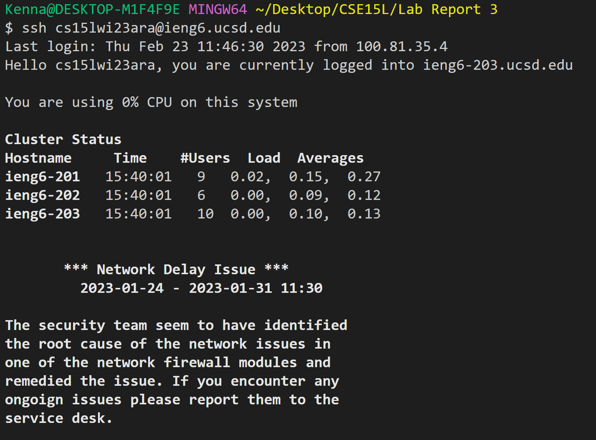
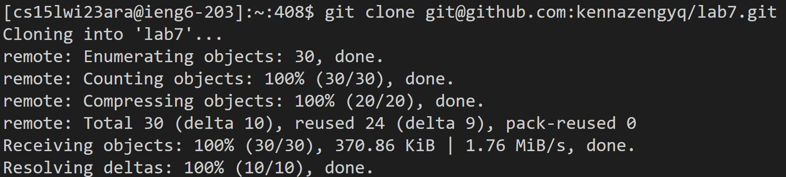
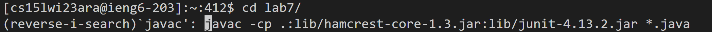
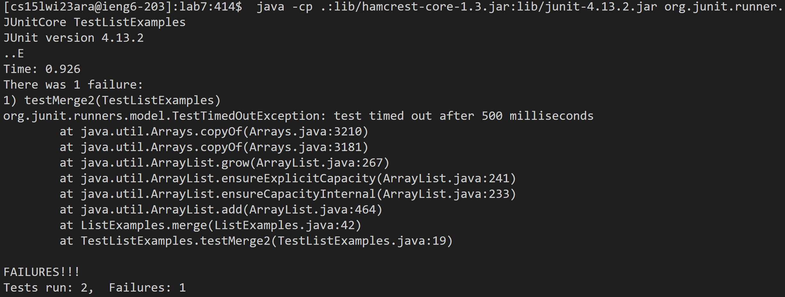
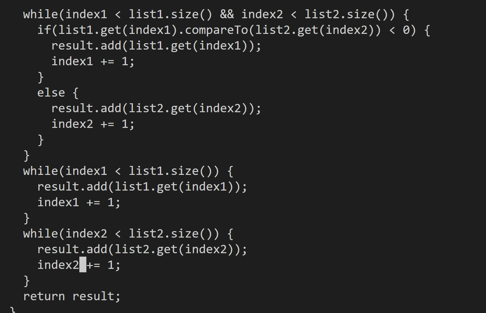
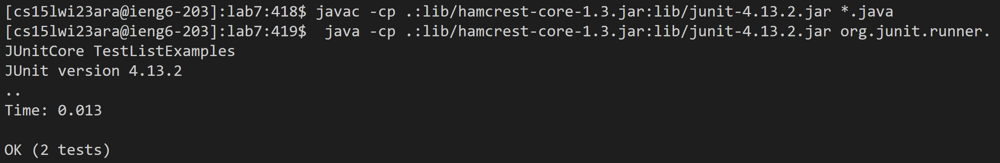

# Lab Report 4  
---
## Log into ieng6  
As my first step upon opening bash is usually logging into ieng6, a simple press of ```<up><enter>``` brings up my past `ssh` command and logs me in.  
With a keygen set up, I do not need to enter my password.  
  

## Clone your fork of the repository from your Github account  
On the fork of the github repo, click the dropdown on ```Code``` and copy the SSH clone link.  
In bash, I typed ```git clone <ctrl><v><enter>``` to clone the repo.  
  

## Run the tests, demonstrating that they fail
Change the directory to lab7 by typing ```cd l<tab>```  
Then I pulled up bash history with ```<ctrl><r>```, and typed ```javac``` to compile all java files.  
  
To run the test file, I pulled up bash history with ```<ctrl><r>``` again, but typed ```java<space>``` instead to get the java command.  
  

## Edit the code file to fix the failing test  
To pull up nano editor, I typed ```nano L<tab>j<tab>```  
I pressed and held  ```<down>``` until I reached the bug on line 43. Pressing and holding the ```<right>``` key, I changed ```index1``` to ```index2```.  
  
To save the file, I pressed ```<ctrl><O><enter><ctrl><X>```  

## Run the tests, demonstrating that they now succeed  
To run the javac command again, I pressed ```<up>``` thrice and hit ```<enter>```.  
To run the java command, I pressed ```<up>``` thrice and hit ```<enter>``` again.  
  

## Commit and push the resulting change to your Github account (you can pick any commit message!)
To add, commit and push, I typed out the following commands:
```
git add *.java
```
```
git commit -m "ok"
```
```
git push
```  
And that's all the tasks! 
---

## Winning strategy for the tournament  
The fastest way I figured out to execute all the commands was to combine all tasks into one gigantic command.   
This means joining all commands with a ```;```, and using a command in command line to edit the java file rather than nano.  
```
git clone git@github.com:kennazengyq/lab7.git ; 
cd lab7 ; javac -cp .:lib/hamcrest-core-1.3.jar:lib/junit-4.13.2.jar *.java ; 
java -cp .:lib/hamcrest-core-1.3.jar:lib/junit-4.13.2.jar org.junit.runner.JUnitCore TestListExamples ; 
sed -i '43s/.*/index2 += 1;/' ListExamples.java ; 
javac -cp .:lib/hamcrest-core-1.3.jar:lib/junit-4.13.2.jar *.java ; 
java -cp .:lib/hamcrest-core-1.3.jar:lib/junit-4.13.2.jar org.junit.runner.JUnitCore TestListExamples ; 
git add *.java  ; git commit -m “ok” ; git push

```
I'm salty that I didn't win but it's okay because at least the winner used the same strategy as me. 
