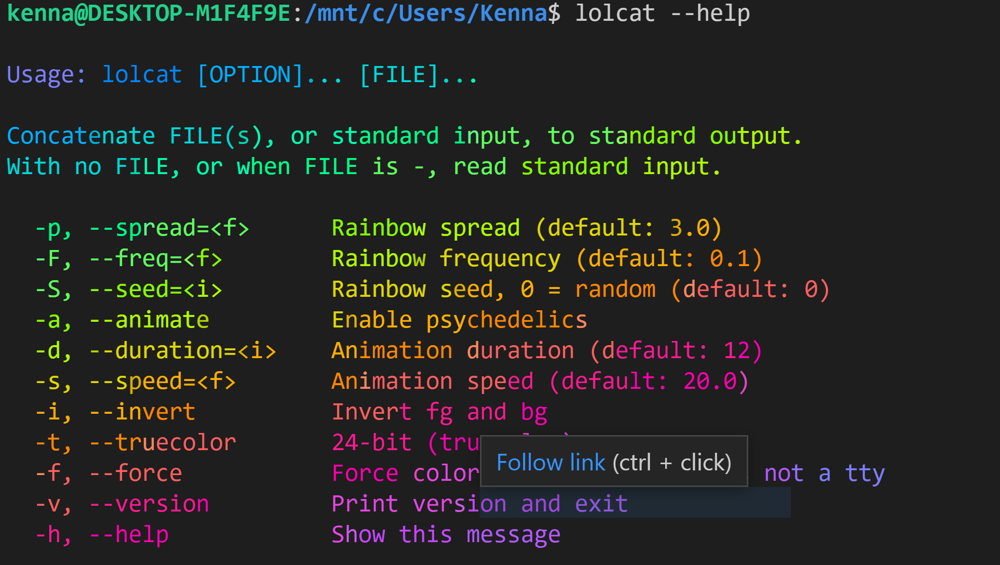
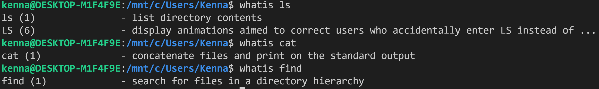
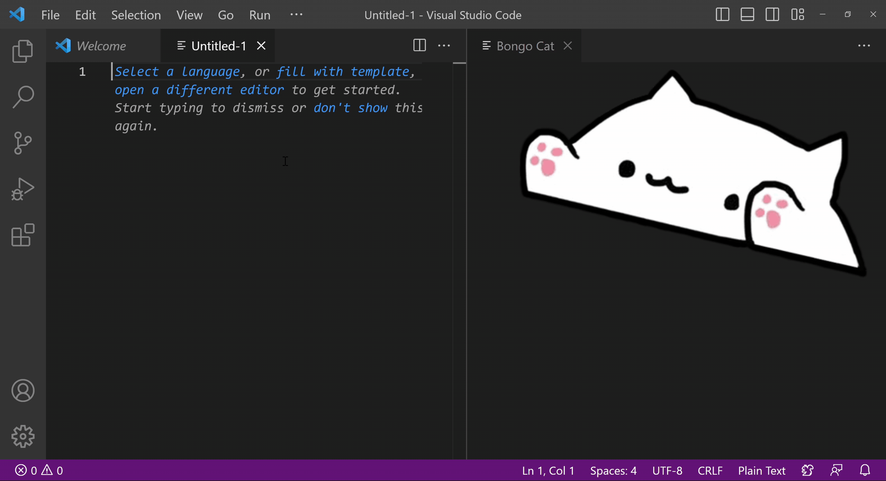
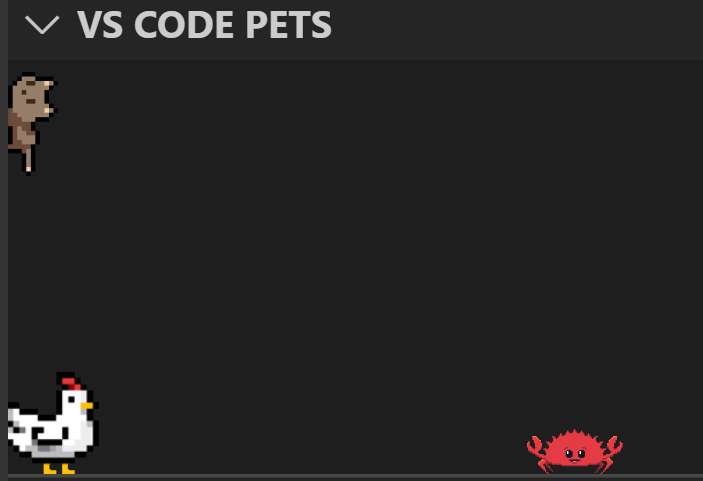

# Fun Commands  
So I wanted to do an extension of lab report 3 by exploring some commands in bash. In particular, I wanted to find some fun and not so "practical" commands that I could do in the command line.    
Sadly, it didn't take me long to realize that all the fun stuff is only really possible on Linux, which led me down a rabbithole of Windows Subsystem for Linux. 

## Installing WSL  
I'm not going to try to explain what's WSL because I barely understand it myself, I just know that it lets me do cool-linux-stuff on my Windows laptop. To install WSL2, I ran the following command in my VSCode shell:  
```
wsl --install
```  
I waited for it to install, restarted my computer and Ubuntu started installing. I just followed the set-up instructions (setting up my username and password) and I was good to go!  
  
  
  
  
I was a bit insulted when it told me that "Kenna" was a "bad name" for my UNIX username, but turns out I just shouldn't capitalize the first letter.  
I opended VSCode and opened my terminal as usual. I switched out of git bash by clicking the little "+" button and selecting WSL.  
  
Last step to installation, I ran the following command:  
```
sudo apt update
```  
I ran this because when I tried to install one of the packages below, I was getting ```unable to locate package```. Updating the repository cache seemed to do the trick.  Note that I'm running the default repository, Ubuntu, on WSL2, so my commands will be for that.

## Steam Locomotive  
Finally, we get to the fun part. One of the most popular fun commands is the Steam Locomotive. To install it and run it, enter the following command:  
```
sudo apt install sl
sl
```  
Then watch as a steam locomotive moves across your screen.  
  

## Fortune  
This one is for my horoscope/astrology girlies. Install the fortune package with the following command:  
``` sudo apt install fortune ```  
Run the ```fortune``` command!
```
kenna@DESKTOP-M1F4F9E:/mnt/c/Users/Kenna$ fortune
Look afar and see the end from the beginning.
```
I was a bit ???? by this fortune so I ran it a few more times:  
```
kenna@DESKTOP-M1F4F9E:/mnt/c/Users/Kenna$ fortune
If you tell the truth you don't have to remember anything.
                -- Mark Twain
kenna@DESKTOP-M1F4F9E:/mnt/c/Users/Kenna$ fortune
The mind is its own place, and in itself
Can make a Heav'n of Hell, a Hell of Heav'n.
                -- John Milton
kenna@DESKTOP-M1F4F9E:/mnt/c/Users/Kenna$ fortune
It is a wise father that knows his own child.
                -- William Shakespeare, "The Merchant of Venice"
kenna@DESKTOP-M1F4F9E:/mnt/c/Users/Kenna$ fortune
He was part of my dream, of course -- but then I was part of his dream too.
                -- Lewis Carroll
```
And all I got was quotes from white guys which I liked even less. 2/10 I don't like this package.  

## lolcat  
Looking at the same dark mode code can get boring at times. So the next time you need to use ```cat```, why not spice it up a bit.  
Install lolcat with
```
sudo apt install lolcat
```  
Now you can use ```lolcat``` instead of ```cat```, and this would concatenate stuff in rainbow colors. 



## whatis
Taking a break from the "useless" commands, here is a built-in command that can actually come in pretty useful. If you ever just want to know what a command does, but don't want to be blasted with the super long documentation, use the following command:  
```
whatis <command>
```  
This gives you a one-line summary of what a command does.  
  

## Bonus: Fun VSCode Extensions  
As a bonus, here's two extensions that I found (thanks titktok) that makes coding slightly more fun for me.   
  
  
### Bongo cat
Install the Bongo Cat Buddy Extension [here](https://marketplace.visualstudio.com/items?itemName=JohnHarrison.bongocat-buddy). Basically, you can pull up a bongo ca that types along with you.  
  
Whether this is a "waste" of screen space is up to you to decide.  

### VS Code Pets
For something less intrusive(?), you can install the vscode pets extension [here](https://marketplace.visualstudio.com/items?itemName=tonybaloney.vscode-pets&ssr=false#qna)  
This allows you to add a variety of animals into your little pets corner and they will just do their thing while you code.  
  

## Conclusion
A simple google search of "fun linux commands" can keep you entertained for an entire lab session.
